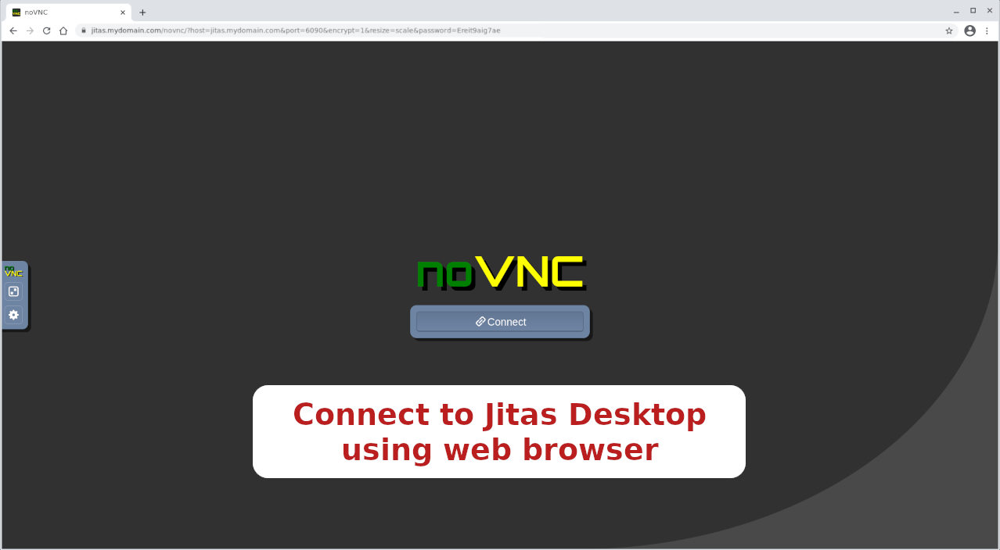

# jitas - Jitsi Assistant

### Table of contents

- [1. About](#1-about)
- [2. Prerequisites](#2-prerequisites)
  - [2.1 Machine Features](#21-machine-features)
  - [2.2 Distribution](#22-distribution)
  - [2.3 Public Ports](#23-public-ports)
- [3. Installation](#3-installation)
- [4. Let's Encrypt support](#4-lets-encrypt-support)

#### 1. About

`Jitas` is a cloud-based virtual desktop environment that assists the presenter
to share high quality materials in the Jitsi session.

[This project](https://platform-euhack21.bemyapp.com/#/projects/607dea7c972ccc0019009868)
started developing on April 26th at
[Winning over the classroom with Jitsi](https://euhack21.bemyapp.com/)
Hackathon.

#### 2. Prerequisites

Check the following steps before starting installation.

##### 2.1 Machine Features

At least 4 cores and 8 GB RAM are recommended.

##### 2.2 Distribution

`Jitas` currently supports only `Debian 10 Buster`. Please create or install a
`Debian 10 Buster` server and don't install a desktop environment, only the
standard packages...

##### 2.3 Public Ports

If the server is behind a firewall, open the following ports:

- `TCP/80`
- `TCP/443`
- `TCP/6080`
- `TCP/6090`

#### 3. Installation

Run the following commands as `root`

```bash
wget -O debian-buster-mate https://raw.githubusercontent.com/jitsi-contrib/jitas/main/installer/debian-buster-mate
bash debian-buster-mate
```

#### 4. Let's Encrypt Support

To set the Let's Encrypt certificate, run the following commands as `root`:

```bash
set-letsencrypt-cert "your-host-fqdn"
```

#### 5. Usage

##### 5.1 Connect to the meeting room

Connect to a meeting room as usual. For example click this:
[https://meet.jit.si/jitas](https://meet.jit.si/jitas)

##### 5.2 Connect to Jitas server

Open a second tab in your browser and connect to `Jitas` server. Each server has
its own password created during the installation. Check the `README-JITAS.txt`
file in your `/root` folder to learn the `Jitas` URL.

The format of `URL`:

`https://HOST-ADDRESS/novnc/?host=HOST-ADDRESS&port=6090&encrypt=1&resize=scale&password=VNC-PASSWD`


